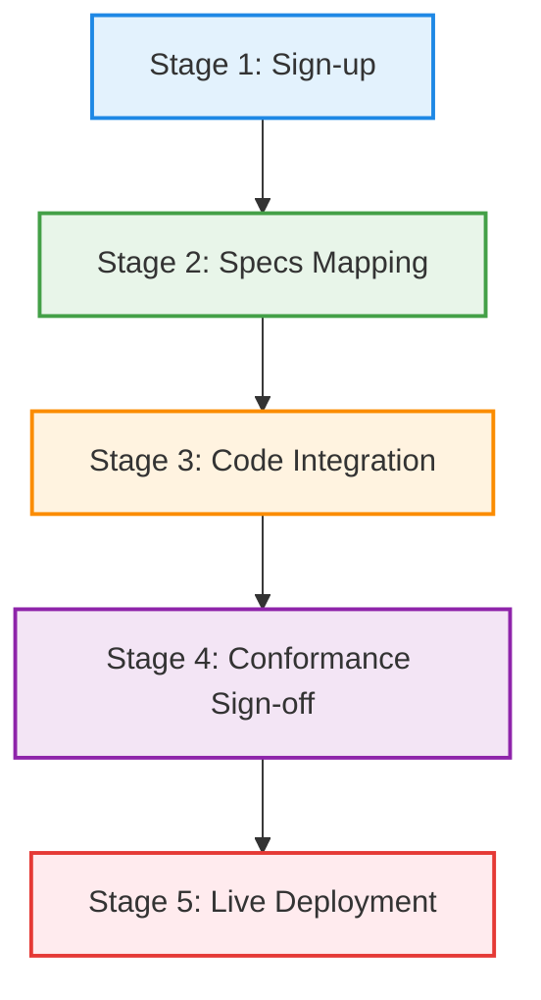
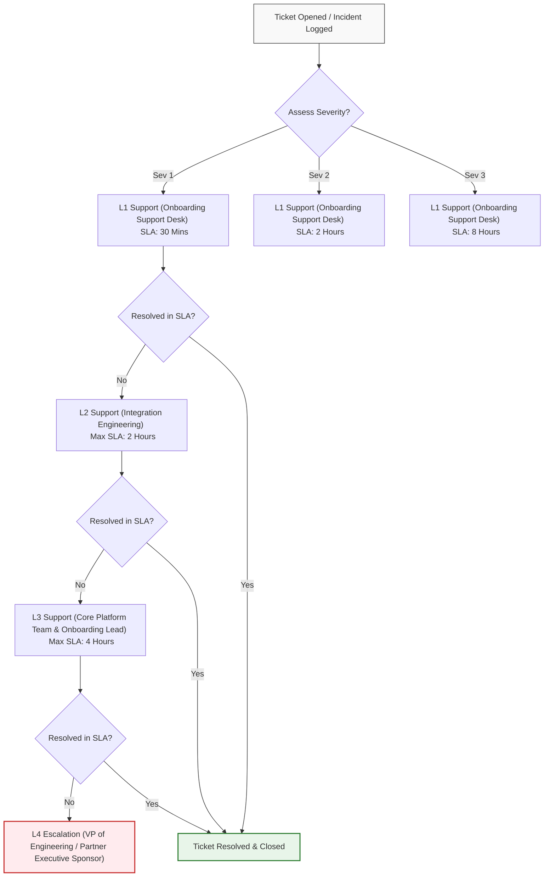

# Google Antigravity Pilot Program: Customer Onboarding Runbook

> [!WARNING]
> Superseded research artifact - not an approved product commitment. The approved
> post-0.0.0.4 direction is governed by
> `docs/product/visual-integrity-strategy.md`,
> `docs/product/capability-matrix.md`, and DEC-017.

Welcome to the **Google Antigravity (AGY)** Pilot Program. This runbook serves as the authoritative operational guide for onboarding new enterprise pilot customers. It details the structured stages of onboarding, key customer milestones, telemetry limits, and support escalation procedures.

---

## 🗺️ Onboarding Lifecycle Overview

The onboarding process transitions the customer from registration to active production usage over five distinct stages. 



---

## 1. Five Onboarding Stages

### Stage 1: Sign-up
* **Objective:** Establish access controls, provision secure sandbox environments, and configure basic tooling permissions.
* **Key Tasks:**
  1. Register the customer's corporate domain in the Antigravity Partner Registry.
  2. Provision the organization's dedicated workspace on the Antigravity developer portal.
  3. Install the **Antigravity CLI (`agy`)** on the developer machines:
     ```powershell
     # Install the CLI using official channels
     npm install -g @google-antigravity/cli
     ```
  4. Perform initial authentication:
     ```sh
     agy login
     ```
  5. Set up initial security preferences in the global configurations:
     * Check active settings at `~/.gemini/antigravity-cli/settings.json`.
     * Configure the **Tool Execution Policy** (recommended: `request-review` or `strict` for local developers).

### Stage 2: Specs Mapping
* **Objective:** Map customer codebase architecture to Antigravity context engines and define project-scoped rules.
* **Key Tasks:**
  1. Perform a code dependency and structure review. Identify major languages, frameworks, and third-party API usage.
  2. Configure **Project-Level Settings** within the workspace root directory:
     * Create/update `.antigravity/settings.json` overrides.
     * Configure non-workspace file access policies (`deny` or `ask`).
  3. Specify model requirements (e.g., pinning the active model to `Gemini Pro` or `Gemini Next`).
  4. Create custom rules and hooks in the repository (`.antigravity/rules/` and `.antigravity/hooks/`) to enforce internal development guidelines, compliance checks, and architectural boundaries.
  5. Optionally register customer-specific **Model Context Protocol (MCP)** servers to enable safe access to internal database schemas and private API documentation.

### Stage 3: Code Integration
* **Objective:** Integrate the Antigravity Python SDK into development pipelines, automated test suites, and internal scripts.
* **Key Tasks:**
  1. Add the Antigravity dependency to the project's dependency manifest (`requirements.txt` or `pyproject.toml`):
     ```sh
     pip install google-antigravity
     ```
  2. Implement agent instantiation inside python pipelines using the asynchronous context manager:
     ```python
     import asyncio
     from google.antigravity import Agent, LocalAgentConfig, CapabilitiesConfig

     async def run_pipeline():
         # Enforce standard sandboxing and capabilities
         config = LocalAgentConfig(
             system_instructions="You are a code validation assistant.",
             capabilities=CapabilitiesConfig(
                 enable_write_tools=True,
                 enable_sandbox=True
             )
         )
         async with Agent(config) as agent:
             # Run code generation, refactoring, or analysis steps
             response = await agent.chat("Analyze local-diff for syntax compliance.")
             async for token in response:
                 print(token, end="")
     ```
  3. Test command execution inside the sandboxed shell to verify isolation layers.

### Stage 4: Conformance Sign-off
* **Objective:** Execute structured validation tests to certify sandbox security, safety alignment, and telemetry limits compliance.
* **Key Tasks:**
  1. Execute the Antigravity Conformance Suite against the integrated codebase.
  2. Verify safety filters (ensure the model blocks harmful outputs and complies with company data-loss prevention policies).
  3. Verify that non-workspace file boundaries are properly blocked.
  4. Submit the conformance test results to the Google Antigravity Integration team.
  5. Acquire official **Conformance Sign-off** from both the customer security lead and the Google partner engineer.

### Stage 5: Live Deployment
* **Objective:** Transition the integrated pipelines to live staging and production environments, enabling active telemetry monitoring and alerting.
* **Key Tasks:**
  1. Promote configuration files (`.antigravity/settings.json`, `.antigravity/rules/`) to the production branch.
  2. Activate runtime licenses and update API keys.
  3. Enable centralized monitoring through the Antigravity Admin Console.
  4. Conduct the official Go-Live review meeting.

---

## 🎯 Key Customer Milestones

The progression of the onboarding program is measured against the following key milestones:

| Milestone ID | Milestone Name | Description & Key Criteria | Primary Owner | Target Timeline |
|:---|:---|:---|:---|:---|
| **M1** | **Workspace Initialized** | Customer accounts provisioned, CLI installed, and `agy login` successfully executed by all pilot developers. | Customer IT Admin | Day 2 |
| **M2** | **Specs & Policy Alignment** | Workspace policies configured; architectural dependencies mapped; rules/hooks defined. | Integration Engineer | Day 5 |
| **M3** | **SDK Integration Verified** | SDK successfully integrated into customer development environment; first programmatically spawned agent test successful. | Lead Dev (Customer) | Day 12 |
| **M4** | **Conformance Certified** | Conformance suite execution successfully completed with zero safety, security, or sandbox violations. | Security Lead & PE | Day 18 |
| **M5** | **Production Go-Live** | Production deployment verified, telemetry metrics actively streaming, and official pilot kickoff. | Product Sponsor | Day 21 |

---

## 📊 Telemetry and Usage Limits

To guarantee system stability, fair resource sharing, and prevent runaway loops, the pilot program enforces the following telemetry limits:

| Telemetry Type | Limit Parameter | Pilot Default Value | Enforcement Behavior |
|:---|:---|:---|:---|
| **API Request Limits** | Requests Per Minute (RPM) | `300 RPM` | HTTP 429 (Rate Limit Exceeded) - Auto-retry after cooldown. |
| **Token Quotas** | Daily Token Quota (Input + Output) | `50,000,000 Tokens/Day` | Hard stop on token generation. Alerts sent at 80% usage. |
| **Agent Sessions** | Concurrent Active Agents | `5 Sessions per Developer seat` | Subsequent agent spawn requests block until active sessions exit. |
| **Network Egress** | Egress Data Limit per Agent Block | `100 MB / execution block` | Sandbox network socket terminates; execution throws `NetworkQuotaExceeded`. |
| **Log Storage** | Audit Logs and Transcripts Retention | `30 Days` | Automated rolling pruning of logs older than 30 days. |
| **Sandbox Workspace** | Workspace Size Cap | `10 GB` | Disk writes block if the workspace sandbox size exceeds the cap. |

> [!NOTE]
> Standard notification alerts are sent via the developer portal when a workspace reaches **80%** of its daily token quota. Custom adjustments to these quotas require approval from the Onboarding Lead.

---

## ☎️ Support SLA & Escalation Workflows

### 1. Severity Levels & Target Response Times
Our team provides prioritized support for pilot customers based on the severity of the incident.

| Severity Level | Definition | Target Response (SLA) | Workarounds & Updates | Target Resolution |
|:---|:---|:---|:---|:---|
| **Severity 1 (Critical)** | Core pilot workflow is blocked. Sandbox environments down, token quotas blocked globally, or critical security vulnerabilities identified. | **< 30 Minutes** | Updates provided every 30 mins via Slack/PagerDuty. Continuous effort 24/7. | **< 4 Hours** |
| **Severity 2 (High)** | Major functionality degradation. Uncaught SDK crashes, TUI performance drops, or rules failing to apply. | **< 2 Hours** | Updates provided every 4 hours. Managed during business hours. | **< 1 Business Day** |
| **Severity 3 (Normal)** | General questions, documentation feedback, TUI styling suggestions, or feature requests. | **< 8 Hours** | Daily status updates. | **< 3 Business Days** |

### 2. Support Escalation Matrix
If the SLA response or resolution window is missed, tickets are automatically escalated according to the workflow below:



### 3. Contact Roles and Escalation Channels

In the event of an escalation, use the designated channels below:

* **Support Desk (L1):** 
  * *Channel:* `#agy-pilot-support` on Slack (Primary)
  * *Email:* `antigravity-pilot-support@google.com`
* **Integration Engineering Lead (L2):**
  * *Contact:* Alex Mercer (`amercer@google.com`)
  * *Slack Handle:* `@alex-mercer`
* **Onboarding Program Lead (L3):**
  * *Contact:* Sarah Jenkins (`sjenkins@google.com`)
  * *Phone / Pager:* Via PagerDuty incident assignment
* **Executive Escalations (L4):**
  * *Sponsor:* Elena Rostova (`erostova@google.com`, VP of Developer Platforms)
