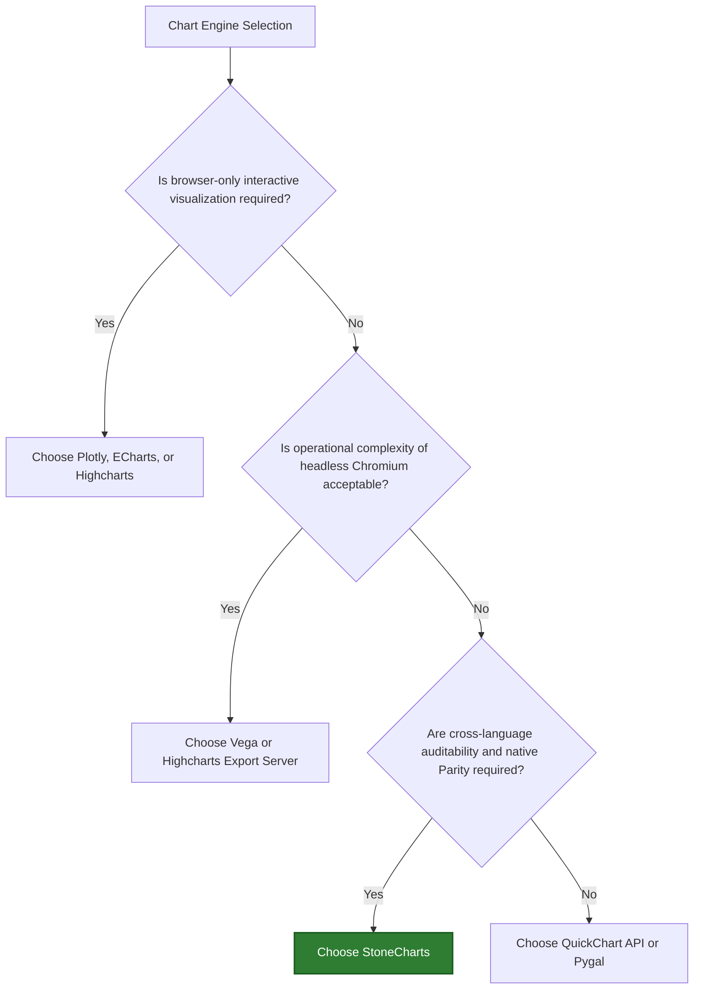

# Market Validation Plan

> [!WARNING]
> Superseded research artifact - not an approved product commitment. The approved
> post-0.0.0.4 direction is governed by
> `docs/product/visual-integrity-strategy.md`,
> `docs/product/capability-matrix.md`, and DEC-017.

StoneCharts must transition from a technically elegant byte-parity oracle to a commercially validated infrastructure asset. This document details the value translation matrix, competitive dynamics, gap mitigation roadmap, and the execution of the first validation experiment.

---

## 1. Value Translation Matrix

We must not sell the *technical mechanism* (byte-identical SVGs); we must sell the *business outcome* (traceability, operational simplicity, audit compliance).

| Engineering Primitives | Customer Business Benefits | Impact Metric |
| :--- | :--- | :--- |
| **Byte-identical SVG** | Reports generated in Go services and Python analysis pipelines look identical and are auditable. | Zero visual drift across platforms |
| **Shared JSON Schema** | Product and backend teams use the same chart spec; no visual logic is reimplemented. | 50%+ reduction in chart integration dev hours |
| **Native Renderers (No Node/Chromium)** | No headless browser, Node daemon, or external container is required in execution environments. | 80%+ lower memory footprint, zero headless browser CVEs |
| **Capability manifest / non-fatal errors** | Unsupported chart settings fail visibly during validation rather than rendering garbled charts. | Zero silent visual corruptions in production |
| **Golden conformance fixtures** | Upgrades to libraries are tested for visual regression automatically using git diffs of SVGs. | Zero regression bugs on library upgrades |
| **Structured customization** | Brand guidelines are hardcoded in schema themes; prevents arbitrary or unsafe visual alterations. | 100% compliance with brand styling guidelines |

---

## 2. Competitive Positioning

StoneCharts does not compete with browser libraries on visual richness or interaction count. It differentiates on **governance**, **operational footprint**, and **reproducibility**.

### Competitor Comparison

* **Vega / Vega-Lite**: Highly flexible declarative grammar, but relies on Node.js/V8 execution for server-side SVG generation. StoneCharts operates with zero script compilation overhead in native Go and Python.
* **Highcharts Export Server**: Highly polished visual results, but requires running Puppeteer/Chromium instances. This introduces significant operational overhead and security exposure in restricted, secure, or air-gapped systems.
* **QuickChart**: Convenient hosted image rendering API, but represents an external cloud dependency that many regulated enterprise customers (finance, defense, healthcare) reject due to data privacy policies.

---

## 3. Regulated Reporting Gap Resolution

To achieve commercial readiness, we must bridge the gaps identified during initial positioning assessments:

> [!IMPORTANT]
> The minimum viable catalog for standard enterprise reports requires more than line, column, and area charts.

### A. Extended Capability Roadmap
* **Bar & Area charts**: Deferred from initial pilot to post-0.0.0.1 release iterations.
* **Scatter & Bubble plots**: Essential for correlation reports.
* **Pie/Donut charts**: Frequently demanded by executive dashboards.
* **Time-Series Axes**: Automatic, locale-aware date-time formatting (e.g., handling UTC, timezones, and custom formats).
* **Reference Lines & Thresholds**: Drawing horizontal/vertical lines representing safety margins, regulatory limits, or average baselines.

### B. Certified Export Pipeline
While the core library focus is deterministic SVG, customers buy final outcomes (e.g., PDFs). StoneCharts will qualify a **Certified Export Path**:
1. Build a helper utility wrapping a light, sandboxed SVG-to-PDF converter (e.g., using `weasyprint` or native bindings like `libspectre`/`librsvg`).
2. Provide pre-built packaging configurations for offline containerized environments.

### C. Constraint Tolerant Layouts
To resolve layout constraints without introducing heavy text-measurement engines:
* **Manual Margin Validation**: Supported margins check for title overlaps.
* **Dynamic Legend Wrapping**: Constraints-based legend placement instead of pixel-perfect alignment.
* **Locale-Aware Formatting rules**: Enforced formatting schemas for numerical values (e.g., SI notation, currency formatting).

---

## 4. The "Deterministic Reporting SDK" Experiment

To validate the product thesis, we will package and execute a pilot experiment targeting 30–40 prospective enterprise organizations.

### Pilot Scope Definition
* **Languages**: Python (>=3.9) and Go (>=1.26) packages.
* **Chart Types**: Line and Column only (Bar, Area, and Scatter are deferred to Post-0.0.0.1).
* **Key Features**: Date/Time scale formatting, manual margins, thresholds, and one certified SVG-to-PDF compilation guide.
* **Validation Tool**: A lightweight CLI tool `stonecharts-conformance` that compares Go and Python outputs and outputs a conformance certificate.

### Key Validation Questions for Interviews

> [!TIP]
> Do not ask: *"Would you use this?"* 
> Instead ask the following sequence to capture actual pain and budget:

1. **"How many independent chart libraries/implementations do you currently maintain across your backend/frontend?"**
2. **"How do you handle chart image generation for scheduled email reports or PDF exports today?"**
3. **"Do you run headless browsers (like Puppeteer or Playwright) in your production containers? Has it caused performance bottlenecks or security audit flags?"**
4. **"Have visual inconsistencies (drift) between what a data scientist sees in a Jupyter notebook and what a client sees in an exported PDF ever caused a support ticket or client complaint?"**
5. **"If we provided a certified, lightweight library that generated identical charts in both Go and Python with no browser dependencies, who in your organization would own the decision to adopt it?"**

### Success Indicators for the Pilot

* **High Interest**: At least 5 organizations sharing their production JSON chart configurations for trial mapping.
* **Workaround Pain**: Discovery of at least 3 organizations paying developers to maintain custom backend rendering wrapper daemons.
* **Willingness to Pay**: At least 1 design partner agreeing to run a paid pilot integration in their staging environment.
